    
    

    
    
    
    
    
    
    
    

## 🐍 Snek

 
    
Collapse

     
        

            <picture>
              <source media="(prefers-color-scheme: dark)" srcset="https://raw.githubusercontent.com/lordronz/lordronz/snek-output/grid-snake-dark.svg" />
              <source media="(prefers-color-scheme: light)" srcset="https://raw.githubusercontent.com/lordronz/lordronz/snek-output/grid-snake-light.svg" />
              
            </picture>
        

## 🎨 Artwork

 
    
Collapse

     
        

            
        

## 📈 Metrics

    
    
    
    
    
    
    

<!-- 
 
    
Calendar

     
        

            
        

 
    
Achievements

     
        

            
        

 -->

## ✅ Summary

    

## 🔧 Technologies

                

## 💻 GitHub Profile Stats

 
    
Collapse

     
        

            
            
            
            
        

    <b>Note:</b> Top languages is only a metric of the languages my public code consists of and doesn't reflect experience or skill level.

 

    

---

    <a href="https://www.aaronct.dev" target="_blank">Website: www.aaronct.dev</a>  

Updated: 25/11/2024 12:51:16
